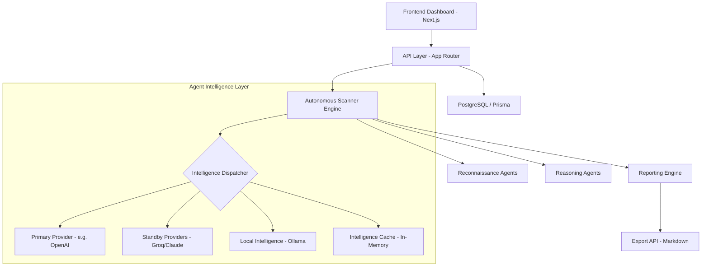

# Sentinel AI - System Design Document

Sentinel AI is an autonomous, distributed security intelligence platform designed for high-velocity auditing and resilient analysis.

## 1. System Architecture Overview

The system follows a modern decoupled architecture with a focus on asynchronous execution and intelligence fallback.

## 2. Core Components

### 2.1 Autonomous Scanner Engine (`scanner.ts`)
The orchestrator of the security mission. It manages the lifecycle of a scan:
- **Initialization**: Target validation and mission creation.
- **Reconnaissance**: Parallel probing of infrastructure and tech stacks.
- **Reasoning**: Concurrent analysis of reconnaissance data using heuristics and LLM intelligence.
- **Persistence**: Real-time telemetry logging and database synchronization.

### 2.2 Intelligence Resilience Layer (`AgentSystem.ts`)
A multi-provider resilience model that ensures "Infinite Intelligence":
- **Provider Fallback**: Automatic rotation of credentials (API Keys) upon rate-limiting or failure.
- **Local Ollama Support**: Support for unrestricted, self-hosted LLM instances.
- **Caching Mechanism**: Reduces costs and latency by caching previous reasoning outputs for similar telemetry patterns.

### 2.3 Security Reporting Engine
Automated generation of audit trails:
- **Markdown Generator**: Structure-aware engine that converts scan findings into professional reports.
- **Technical Metadata**: Includes target URL, executive summaries, finding distributions, and evidence logs.

## 3. Data Flow (Mission Lifecycle)

1.  **Request**: User initiates a scan with a target URL and preferred LLM provider.
2.  **Telemetry Phase**: Scanner launches parallel probes (e.g., Robots.txt, Header Probing, Tech Detection).
3.  **Intelligence Phase**: Recon data is handed off to the Reasoning Agent. The Intelligence Dispatcher selects the best provider or falls back to standby.
4.  **Audit Phase**: Findings are generated, evaluated against confidence thresholds, and persisted to the findings registry.
5.  **Reporting**: Final results are synthesized into a downloadable markdown report.

## 4. Performance Optimization Model

- **Parallel Probing**: Web and Repository reconnaissance paths are probed concurrently using `Promise.all`.
- **Concurrent Finding Generation**: Multiple security issues are processed and written to the database in parallel.
- **HEAD Probing**: Uses HEAD requests for architectural discovery to minimize bandwidth and detect infrastructure without payload overhead.

## 5. Persistence & State Management

- **Database**: PostgreSQL with Prisma for structured scan data and findings.
- **Client Cache**: LocalStorage for API key management and mission persistence across sessions.
- **System Logs**: JSON-based telemetry stored in the database for real-time dashboard updates.

---
*Generated by Sentinel AI Development Agent*
## Licensing & Ethical Boundaries

Sentinel AI is developed with a strict focus on **Ethical Security Research** and **Open-Source Perimeter Analysis**. 

### 🛡️ Compliance Model
*   **Target Scope**: The platform is restricted to public domains and repositories released under OSI-approved open-source licenses. 
*   **Private Data Protocol**: Sentinel AI does not support the analysis of private or proprietary codebases to ensure full compliance with GitHub CodeQL's licensing terms.
*   **Non-Production Use**: This software is intended for educational and research purposes. It is not designed for production-level corporate security audits without a separate commercial license agreement.

### ⚖️ Legal Safeguards
*   **Explicit Consent**: User is responsible for ensuring authorization to scan targets.
*   **Provider Terms**: Users are bound by the terms of service of any integrated LLM providers (OpenAI, Anthropic, etc.).
*   **Unrestricted Intelligence**: Fallback systems (Ollama) are prioritized to ensure mission completion without external API dependency.
